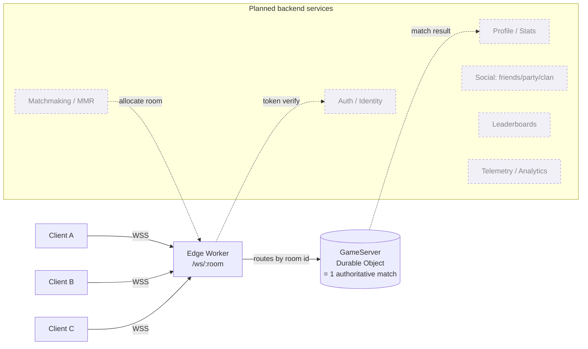
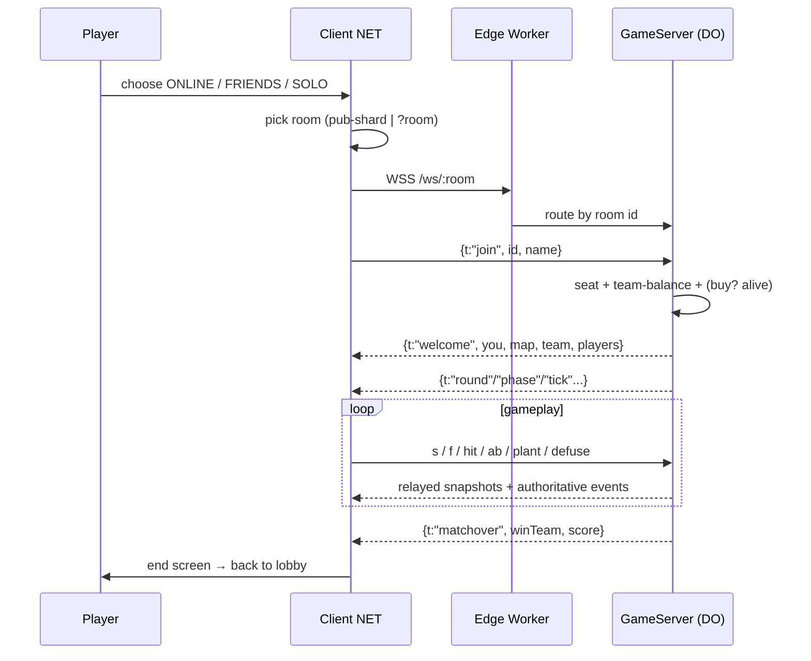
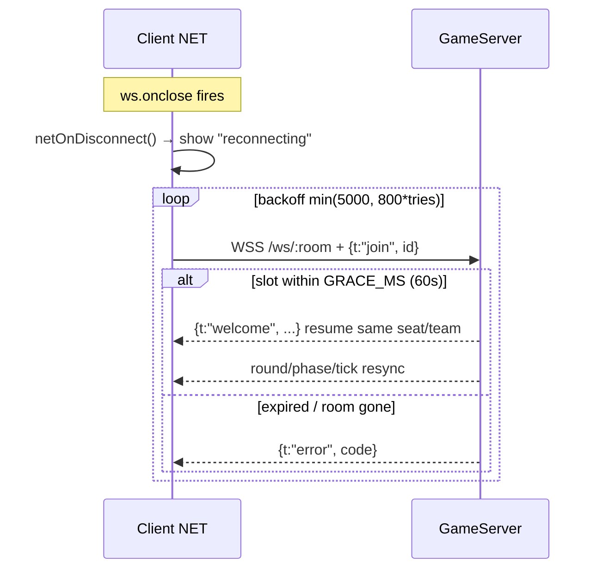

# VANTAGE — Multiplayer Architecture & Online Services

The online framework for Gun Game Arena: fair, responsive, scalable, stable, and
maintainable. It is **original** and grounded in the game's real implementation —
an **edge-authoritative** model (Cloudflare Workers + Durable Objects) — with an
honest map from what ships today to the full AAA target.

Status: ✅ shipped · 🟡 partial · ⬜ specified (needs a persistence backend).
Companion detail lives in [`GAME_DESIGN_DOCUMENT.md`](GAME_DESIGN_DOCUMENT.md)
§9–11, [`PRODUCTION_GUIDELINE.md`](PRODUCTION_GUIDELINE.md) §7, and
[`DEV_TOOLKIT.md`](DEV_TOOLKIT.md) §9.

---

## 1. Topology

Each match is an isolated, single-writer **authoritative server instance** — a
Durable Object (`GameServer`) — provisioned on demand at the edge and addressed
by room id. This *is* the "dedicated authoritative server" model, minus capacity
planning: the platform places and scales instances globally, one per room.



**Shipped (✅):** the client `NET` layer, the edge WebSocket route `/ws/:room`,
and the `GameServer` Durable Object (authoritative 5v5 Search & Destroy). Public
matchmaking is **shard-based** (`pub-1..4`); private play is an invite `?room`
link. **Planned (⬜):** the dashed backend services, which need identity +
storage the browser build doesn't yet have.

## 2. Core principles → how delivered

| Principle | Mechanism | Status |
|---|---|---|
| Server-authoritative gameplay | `GameServer` is sole writer of round/team/score/spike; validates damage | ✅ |
| Low-latency responsiveness | client prediction for own movement/aim; server relays snapshots | 🟡 |
| Fair competition | `MAX_SHOT_DMG` cap, friendly-fire block, team balance on join | ✅ |
| Deterministic gameplay | fixed-timestep sim (`CFG.step`), seeded spread | ✅ client |
| Reliable synchronization | WebSocket (ordered/reliable); authoritative round broadcasts | ✅ |
| Scalable infrastructure | one Durable Object per match, edge-placed, on-demand | ✅ |
| Secure communication | WSS (TLS); server validates every mutating message | 🟡 (auth tokens ⬜) |
| Graceful failure recovery | client reconnect w/ backoff; server `GRACE_MS` slot hold | 🟡 |

## 3. Session lifecycle



Target lifecycle (login → auth → profile sync → party → queue → matchmaking →
allocation → load → warmup → match → stats upload → progression → rewards →
lobby). **Shipped:** room join → seat/team → warmup(buy) → match → end. **⬜:**
login/auth/profile/queue/stats/rewards (backend).

## 4. Live wire protocol

Transport: JSON over WebSocket. Reliable+ordered by TCP, so "reliable events"
are inherent; high-rate snapshots (`s`) are last-writer-wins. Server tick = 1 Hz
(round clock); clients send position snapshots on a fixed cadence.

**Client → server**

| msg | payload | meaning |
|---|---|---|
| `join` | id, name | enter the room |
| `s` | p[x,y,z], y(aw), pi(tch), a(iming) | position snapshot |
| `f` | — | fired (muzzle/relay) |
| `hit` | tgt, d | reports damage on a target (server caps/validates) |
| `died` | killer, x, z | own-death report (drops spike, elim check) |
| `ab` | kind, x, y, z | ability cast (`dash/heal/dismiss/boom/flash/smoke`) |
| `grab` / `plant` / `defuse` | (site,x,z) | spike interactions |

**Server → client**

| msg | key fields | meaning |
|---|---|---|
| `welcome` | you, mode, map, team, players | join accepted + initial state |
| `join` / `leave` | id, name, team | roster changes |
| `s` / `f` | id, p, y, pi, w, a | relayed remote snapshot / fire |
| `hit` | from, d | you took damage |
| `kill` | v, k, aliveA, aliveB | elimination + live team counts |
| `ab` | id, kind, x,y,z | remote ability |
| `spike` | state, site, x, z | spike state sync |
| `round` | roundN, atkTeam, score | new round + assignments |
| `phase` / `tick` | phase, left, planted | buy→live clock |
| `planted` / `defused` / `detonated` | site, spikeTime / by | objective events |
| `roundend` / `matchover` | winner, winTeam, reason, score, next | results |
| `error` | code (`full`, …) | rejection |

Extending the protocol = one `case` in the server switch + one handler in
`netOnMessage`; the 21-check protocol test (`sdservertest.mjs`) gates changes.

## 5. Data models (planned services)

Original schemas the backend services replicate; the match DO already holds the
in-match subset.

```jsonc
// Account (Identity + Profile)
{ "playerId":"uuid", "displayName":"Reyna", "region":"eu",
  "createdAt":"iso", "privacy":{"profile":"friends","joinable":true},
  "stats":{"matches":0,"wins":0,"kills":0,"deaths":0,"assists":0,"hsRate":0,"accuracy":0},
  "progression":{"accountLevel":1,"seasonXP":0,"mastery":{"vandal":{"xp":0,"tier":0}}},
  "cosmetics":{"equipped":{"vandal":"copper_ember"},"owned":["copper_ember"]},
  "social":{"friends":[],"blocked":[],"recent":[]} }

// Party
{ "partyId":"uuid", "leader":"playerId", "members":["playerId"],
  "privacy":"friends", "ready":{"playerId":true}, "queue":null, "region":"eu" }

// Matchmaking ticket
{ "ticketId":"uuid", "party":["playerId"], "queue":"ranked",
  "mmr":1842, "region":"eu", "connQuality":"good", "expandAt":"iso" }

// Match record (written on matchover → Stats/Leaderboard/Progression)
{ "matchId":"uuid","map":"haven","mode":"sd","durationSec":1840,
  "teams":[{"score":13,"players":[...]},{"score":11,"players":[...]}],
  "perPlayer":[{"playerId":"","k":24,"d":11,"a":6,"dmg":4120,"obj":3,"mvp":true}],
  "replayId":"uuid" }
```

## 6. Subsystem status matrix

| Domain | Design owner | Status | Note |
|---|---|---|---|
| **Player account** (id, name, stats, cosmetics, friends, privacy) | Identity+Profile | ⬜ | callsign only today (localStorage); cosmetics sourced from VANTAGE skins |
| **Party** (create/invite/ready/leader/kick/privacy) | Social | 🟡 | private `?room` invite link = a proto-party; full party ⬜ |
| **Friends** (requests, status, join, block, mute) | Social | ⬜ | needs identity |
| **Matchmaking** (SBMM, region, queue health, new-player protection, expansion) | Matchmaking | 🟡 | shard-based public rooms now; MMR ⬜ (needs accounts) |
| **Server management** (scaling, health, region, migration, maintenance, rolling updates, crash recovery, capacity) | Platform (Workers/DO) | ✅/🟡 | auto-scale + edge placement inherent; maintenance/rolling-update flags ⬜ |
| **Network sync** (tick, interpolation, prediction, reconciliation, reliable/unreliable, priority, interest mgmt, dormancy, compression) | GameServer | 🟡 | authority+prediction ✅; interpolation basic; interest/compression ⬜ |
| **Reconnect** (detect, reserved slot, resync, round-state recovery, timeout) | GameServer + NET | 🟡 | client backoff ✅, `GRACE_MS`=60s slot hold ✅; full state resync 🟡 |
| **Spectator** (free/follow cam, cycling, observer UI) | GameServer | ⬜ | dead players spectate 🟡; full observer ⬜ |
| **Replay** (record, timeline, bookmarks, share id, validation) | Match + storage | ⬜ | protocol is serializable → replay is a recorded event log; needs storage |
| **Voice** (PTT, team/party, mute, suppression) | RTC service | ⬜ | WebRTC mesh/SFU; out of current scope |
| **Text chat** (team/party/PM, quick-chat, rate limit, filter) | Social + GameServer | ⬜ | relay is trivial over existing WS; needs mute/filter/rate-limit |
| **Ping / comms wheel** (spotted, go, defend, attack, objective, danger, help, regroup, custom) | GameServer | ⬜ | one new `ping` message + world marker; low-cost, high-value next add |
| **Clan** (create, tag, roles, chat, challenges) | Social | ⬜ | needs identity + storage |
| **Tournament** (lobby, scheduling, observer, brackets, reporting, spectator delay, admin) | LiveOps | ⬜ | builds on custom matches + spectator + replay |
| **Custom matches** (private lobby, password, rules, FF, timers, respawn, bots, observer slots) | GameServer | 🟡 | private rooms + bots (solo) ✅; rule customization UI ⬜ |
| **Leaderboards** (global/regional/season/friends, accuracy, objective, win-rate, mastery) | Stats service | ⬜ | derived from Match records; needs storage |
| **Security** (encryption, session validation, tokens, rate limiting, replay integrity, audit, permissions) | Edge + services | 🟡 | WSS + server-side validation ✅; auth tokens + rate limiting ⬜ |
| **Error handling** (timeout, full, version mismatch, auth fail, queue cancel, reconnect fail, maintenance, retry, friendly messages) | NET + Worker | 🟡 | `error:full`, reconnect retry, user-facing status strings ✅; version/auth/maintenance ⬜ |
| **Analytics** (queue time, duration, reconnect/disconnect rate, utilization, ping, loss, region/party dist, completion) | Telemetry | 🟡 | client telemetry buffer exists (DEV_TOOLKIT §5); server-side aggregation ⬜ |

## 7. Networking deep-dive (current)

- **Authority split:** server owns round/team/score/spike (unforgeable); clients
  own their movement/aim with server **validation** on damage. Appropriate for a
  browser title; the path to ranked-grade is **server-side shot validation + lag
  compensation** (rewind to shooter tick) — the top roadmap item.
- **Rates:** server tick 1 Hz (round clock); clients push position snapshots on a
  fixed cadence, relayed to peers; last-writer-wins for `s`.
- **Reliability:** WebSocket/TCP → all events ordered+reliable; no packet-loss
  recovery layer needed at the app level (TCP handles it) but head-of-line
  blocking is the tradeoff vs. UDP — acceptable at this tick model.
- **To add (⬜):** snapshot interpolation buffer, delta/quantized state
  compression, interest management (only replicate what a client can perceive),
  dormancy for idle actors, priority replication under load.

## 8. Reconnect flow



Shipped: disconnect detection, exponential backoff, 60-second reserved-slot grace
(`GRACE_MS`), and re-`join` on the same id. To harden (🟡→✅): full inventory/
position/round-state resync payload and an explicit reconnect-timeout UX.

## 9. Backend services (target)

Stateless edge functions + managed stores; each service is independently
scalable and owns one concern (no shared mutable state → maintainable):

| Service | Owns | Store |
|---|---|---|
| **Identity/Auth** | accounts, tokens, sessions | user DB |
| **Profile/Stats** | stats, progression, mastery | user DB + match records |
| **Social** | friends, party, clan, presence | graph store + pub/sub |
| **Matchmaking** | MMR, tickets, region, queue health | in-memory + queue |
| **Match** | authoritative gameplay (the DO, ✅) | ephemeral per-match |
| **Leaderboards** | ranked boards | sorted store |
| **Telemetry** | analytics ingestion + dashboards | append log + warehouse |

Cross-cutting: WSS everywhere, signed **auth tokens** verified at the edge before
room join, **rate limiting** per connection (token bucket), **audit logging** of
privileged actions, and **permission tiers** (player / observer / admin).

## 10. Scaling & reliability

- **Scale:** matches scale horizontally as independent Durable Objects placed at
  the edge nearest players; no central match server to saturate. Backend services
  scale statelessly behind the edge.
- **Health & recovery:** the platform restarts a failed instance; clients auto-
  reconnect into the grace window (§8). Rolling updates deploy a new client/
  server bundle without dropping in-flight matches (new rooms use the new code).
- **Maintenance/emergency:** a maintenance flag at the edge can drain queues and
  show a friendly notice; content/version rollback is a one-command redeploy of a
  pinned zip (`design/deploy.json` records the exact artifact).

## 11. Rollout roadmap

1. **Integrity** — server-side hit validation + lag compensation; per-connection
   rate limiting; version handshake on join. *(Highest priority.)*
2. **Identity + Profile** — accounts, tokens, stats/progression persistence →
   unlocks MMR, leaderboards, cosmetics ownership.
3. **Social** — friends, real parties, presence, text chat + the **ping wheel**
   (cheapest high-value in-match add).
4. **Matchmaking** — SBMM over MMR, region, party balance, new-player protection,
   dynamic search expansion, queue-health monitoring.
5. **Spectator + replay** — record the event log (protocol is already
   serializable), observer UI, then tournament support on top.
6. **Voice + clans + LiveOps** — RTC service, clan graph, seasons/events.

### Where VANTAGE stands
A genuinely authoritative, horizontally-scalable, edge-native multiplayer core is
**live**: isolated per-match servers, team-balanced 5v5 Search & Destroy with
validated damage and objective state, public shard matchmaking, private invite
rooms, and reconnect with a reserved-slot grace — all original. The remaining
subsystems are well-specified and gated on one dependency, a persistence backend,
with integrity hardening as the lead item.
